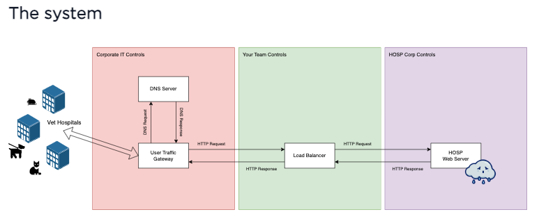
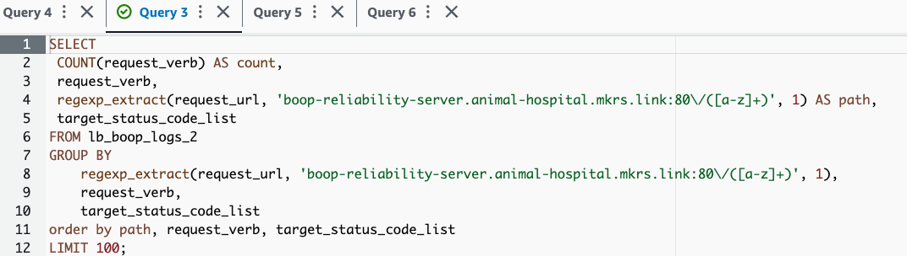
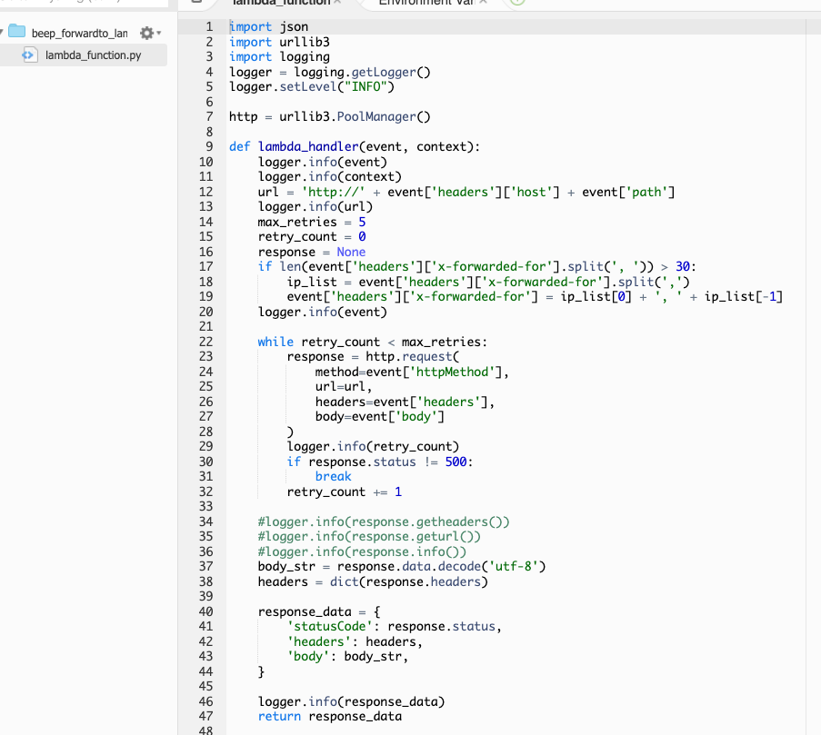
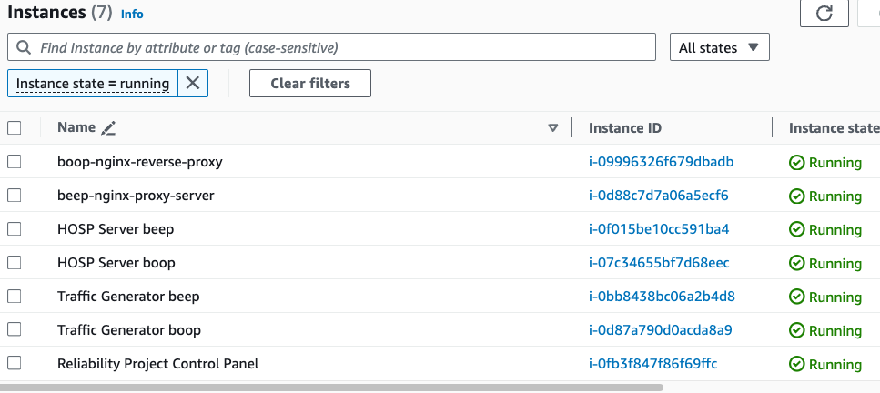
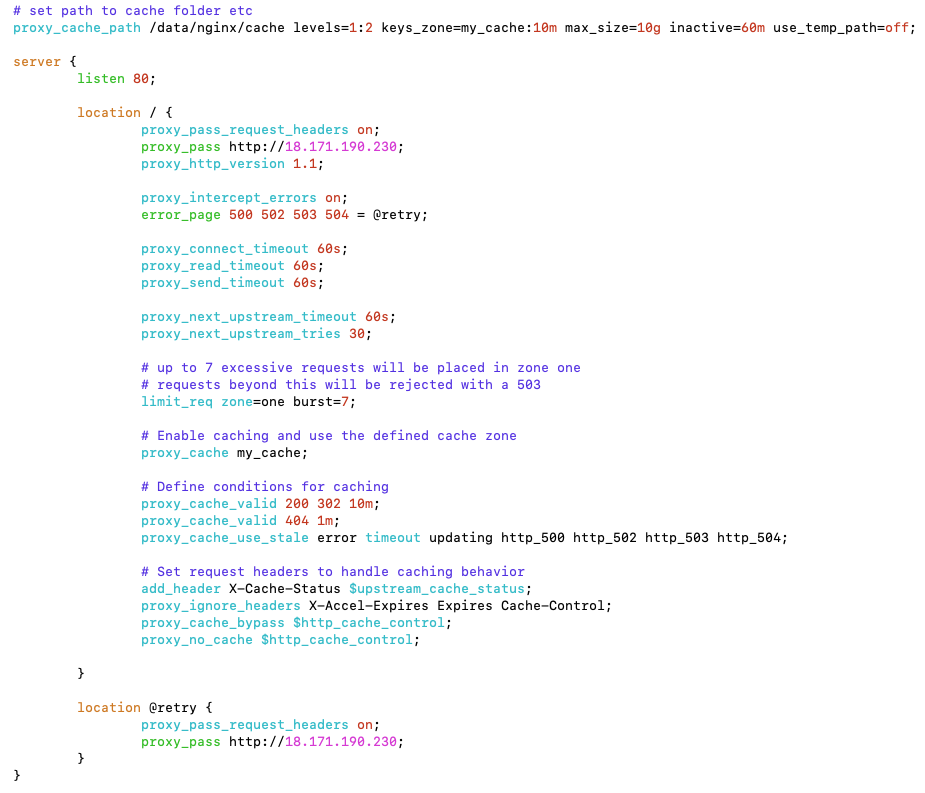
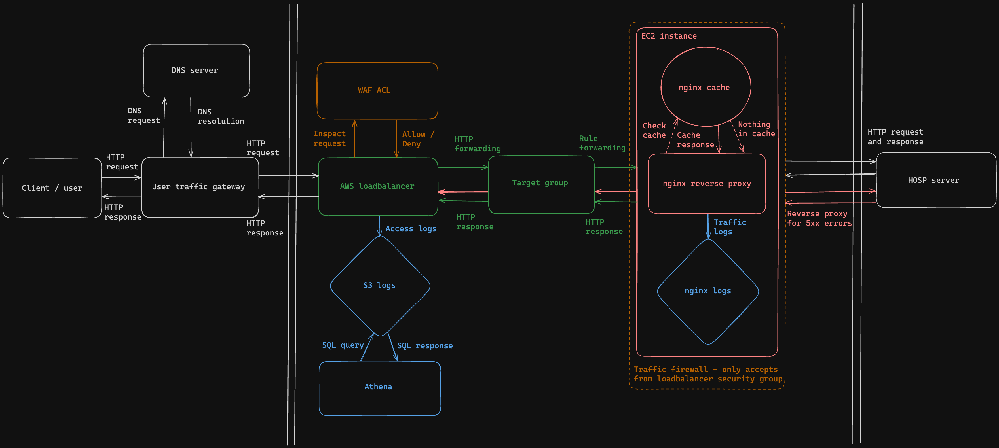

<h1 align="center">
    Reliability Project - AWS
</h1>

## Task / Introduction
---
In a group of four (team - boop) we were tasked to work for a veterinary hospital to manage a system owned by another company "HOSP".
Overview:
 - Preserve the functionality of the system.
 - Increase the reliability/security of the system.
 - Implement improvements to the system.

 

 

Other information:
 - All applications were hosted on AWS.
 - We had no access to source code or DNS resolution but we did have access to API documentation.
 - Sole access to the load balancer only.
 - We could make requests/tickets to the HOSP team for information (small amount).
 - Ensure no security breaches.
 - ensure the system responds successfully to >99% of user requests.

## Initial steps
---
We set up a Trello board to keep track of all tickets and work that had been done or needed to be.
Agreed on agile methodology to move forward as a team.
Implemented security WAF protocols.

First started with gaining visibility over the system with logging:
 - Set an S3 bucket to collect logs.
 - Directed access logs from the load balancer to this bucket.

 

 

Then to more easily view these logs, we set up Athena.

 

 

Results / findings:
 - We saw that there were multiple 5xx errors.
 - Upon checking the API documentation, we found that the server had a small error rate in resolving 5xx errors and needed them to be retried.
 - We agreed that HTTP responses with 5xx errors needed to be retried at the server.

## First attempt at improvements
---
After realising 5xx errors needed to be reverse proxied, we discussed potential options.

One such option was a Lambda:
 - We would set up a target group on the load balancer to redirect traffic through the Lambda.
 - This would parse HTTP responses and check for 5xx errors.
 - Ultimately this failed, but we learnt much along the way.

 

 

Explanation of failures:
 - Implementing a Lambda function like this could have been very powerful and useful if successful.
 - Ultimately, we did not approach this in the right manner, starting with the basics and incrementally improving from there.
 - After we realised this was not working, we decided not to waste time further.

## The Nginx reverse proxy
---
We researched and decided to pursue an Nginx reverse proxy to troubleshoot our errors:
 - We set up a target group to redirect load balancer traffic through an EC2 instance.
 - This instance had nginx with a special configuration implemented.
 - We also adjusted the inbound rules for the instance to only accept traffic from the loadbalancer.

 

 

 

Results:
 - This configuration retried the 5xx error messages and returned them back to the client.
 - We also implemented caching to reduce request times and unburden the web traffic system.

## Final diagram

Our final infrastructure outlined below:

